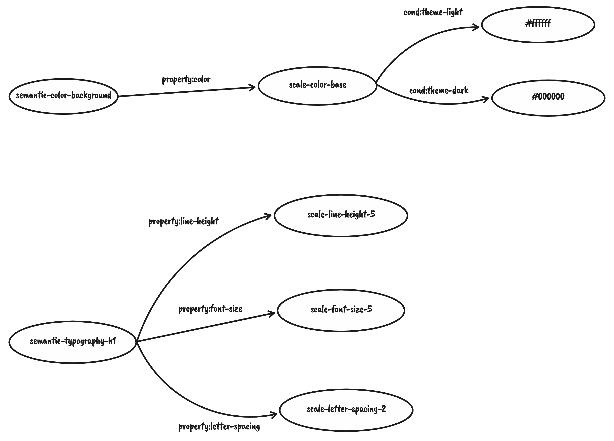

# KDT Specification

Specification for KDT language.

## What is Design Token?

TBD

## What is KDT?

KDT is a language for describing and managing design tokens.

## Content Type

KDT is set of multiple token definitions(`$`) and macros(`%`). Its file extension should be `.kdt` and its media type should be `application/design-tokens+kdt`.

KDT can be serialized to text. Definitions in the serialized text can hold all information design token schema and actual values, but macros can be ignored by runtime.

## Language Concepts

### Prefixed

Every syntax in KDT should always start with special prefix such like `$` or `%`. These prefixes can be used to identify meaningful definitions earlier in a mixed content.

### Graph

Design tokens are essentially a collection of variable definitions that are  finited and serializable. And a design token can be defined with a new meaning by referencing another token.

By naming tokens and configuring the hierarchy for each role, we can build the semantics we need in a design system. These seems exactly the same as how various types of data exchanged on the Web build semantic graph.



This implies that a graph language can express any kind of design token structure.

KDT is structured in a format similar to [N-Triples](https://en.wikipedia.org/wiki/N-Triples), which is the simplest form of serializing a semantic graph.

### Less & More Expressive

At the token definition, too much expressiveness can obscure the the token framework or its semantic. Conversely, where tokens are referenced, it needs a lot of expressiveness to be compatible with many tools.

The KDT should provide each grammar with a suitable expressiveness and extensibility for its purpose.

### Sequential

Tokens can be defined **flat** sequences, instead of relying deeply on nested object form.

This is key difference that makes interoperability with many tools, especially in design tools that don't have configurable metadata form.

This helps design token integration with the native workflow of design tools without external service.


### Domain-specific

Instead of being compatible with every possible cases, KDT focuses more on the real problem. That means KDT would have some opinions on how to define and to manage design tokens.

## Anatomy of KDT

KDT defines two types of tokens, **"scale tokens"** and **"semantic tokens"**.

The scale token is for low-level definition. Its purpose of the scale token is to define a finite number symbols and make it platform-agnostic by hiding display details behind of it.

The value bound to the scale token may depends on application context or user preferences. If it always need a fixed value regardless of context, you can define it as a **static token**.

The semantic token is for high-level definition. It abstracts the token by giving it a unique meaning so designers and developers can have same language.


## Syntax

### Scale Token Definitions (`$scale` and `$static`)

Scale tokens can be declared as `{prefix}.{target}.{name}`.

- `prefix` can be `$static` or `$scale`.
- `target` is the pre-defined name associated with the actual display. 
- `name` is *unique* id, can contain alphanumeric, and `-`.

```
$scale.color.carrot-100
$scale.color.carrot-200
$scale.color.carrot-300
$scale.color.carrot-400
$scale.color.carrot-500
```

#### WIP: Binding Target

TDB: Should verify that this has the same semantics as _theme scales_ at [Theme specification](https://theme-ui.com/theme-spec/)

Definitions can have value binding via `->` operator.

```
$scale.color.carrot-100 -> #FFF5F0
$scale.color.carrot-200 -> #FFE2D2
$scale.color.carrot-300 -> #FFD2B9
$scale.color.carrot-400 -> #FFBC97
$scale.color.carrot-500 -> #FF9E66
```

The available value bindings depend on the target.

| Target        | Available value formats                                                         |
|:------------- |:------------------------------------------------------------------------------- |
| `color`       | hex (`#FFFFFF`), RGB (`rgb(255, 255, 255)`), RGBA(`rgba(255, 255, 255, 1.0)`)   |
| `opacity`     | percentage (`70%`)                                                              |
| `font-family` | quoted string                                                                   |
| `font-size`   | integers (pt)                                                                   |
| `font-weight` | `thin`, `regular`, `bold`                                                       |
| `line-height` | integers (pt), percentage (`70%`)                                               |

It is intentionally defined to be web-like, but it should be kept in mind that they are not identical and may be used differently by different platforms.

#### WIP: Conditional Binding

TBD: Find better syntax

The actual value pointed by a scale token can be changed according to user preference or some application context.

A scale token definition can includes a condition to specify the context.

```
$scale(theme=light).color.carrot-500 -> #ff7e36
$scale(theme= dark).color.carrot-500 -> #ed7735
```

You can combining multiple conditions, separate them with `,` and list them.

```
$scale(theme=dark,contrast=high).color.carrot-500 -> #ed7735
```

Specify `*` to value to select all values (= no select) for a particular condition. This is the default for all implicit condition.

```
$scale(theme=light,contrast=*).color.carrot-500 -> #ff7e36
```

Sometimes you need token that always have a fixed value regardless the context. You can define it as "static token".

```
$static.color.white -> #fff;
```

The `$static` is semantically equivalent to a `$scale(*)`, but it is defined in a separate namespace so that it can have a name that is duplicated with a scale token.

### Semantic Token Definitions (`$semantic`)

The format of semantic token is `{prefix}.{group}.{name}`. `group` and `name` is unique identifier.

```
$semantic.color.primary
$semantic.color.secondary

$semantic.typography.title
$semantic.typography.subtitle
```

The semantic tokens can have reference binding to scale tokens via `->` operator.

```
$semantic.color.primary -> $scale.color.carrot-500
```

Also, it can be compsition of multiple references.

```
$semantic.color.background -> $scale.color(theme-dark).gray-100
$semantic.color.background -> $static.color.static-white
```

### Token Description

You can leave a single line of comment on a specific token using `??` operator.

```
$semantic.color.primary ?? This is primary color
```

The description of every node is initialized to an empty string in the absence of an explicit binding.

## Design Token Scheme

Scheme is the source of truth, an intepreter including all information about the confirmed design tokens.

The AST of KDT is converted to a scheme to be used.

TBD: Define a IR that useful in extensions

### Resolving Value of a Semantic Token

A semantic token is defined as a composition of different scale tokens.

Only one value per scale target can be reflected in the actual program. The condition always chooses the more specific one declared last.

TBD: Define a concrete algorithm

## Extensions & Macros (`%`)

KDT can direct additional runtime behavior via macros. Macros are defined as `%{extension}:{name}({arguments})`.

Macros are extended with user extensions based on runtime requirements. only `KDT` extension is reserved.

### Pre-defined extension

KDT:

KDT is built-in, and is the only extension can transforms the scheme. The scheme retained as read-only for all other extensions. It may be included in the syntax later.

- `%KDT:deprecate(token)`: Mark a specific token has been deprecated.
- `%KDT:color(target)`: Specifies the default target to be used by subsequent `color` token definitions.
- `%KDT:opacity(target)`: Specifies the default target to be used by subsequent `opacity` token definitions.
- `%KDT:font-family(target)`: Specifies the default target to be used by subsequent `font-family` token definitions.
- `%KDT:font-size(target)`: Specifies the default target to be used by subsequent `font-size` token definitions.
- `%KDT:font-weight(target)`: Specifies the default target to be used by subsequent `font-weight` token definitions.
- `%KDT:line-height(target)`: Specifies the default target to be used by subsequent `line-height` token definitions.

Note: `%KDT` extensions are kind of a use case dumpster. All macros here should be addressed in the main syntax.

### Example extension for Figma

- `%figma:printf(format, token)`: Sets the frame text to the token (property) in specific format. (for documentation purpose)
- `%figma:fill(token)`: Sets the frame fill color to the value of the specific token.

## ABNF (incomplete)

```abnf
KDT = *Line

Line = (TokenDefinition / TokenDescription) EOL

TokenDefinition =
  / SemanticTokenDefinition
  / ScaleTokenDefinition

TokenDescription = Token _ DescribeOperator _ Text

Token =
  / SemanticToken
  / ScaleToken

SemanticTokenDefinition = SemanticToken [_ BindOperator _ (ScaleToken / StaticToken)] EOL

SemanticToken = SemanticPrefix . group:Identifier . name:Identifier

SemanticPrefix = "$semantic"

ScaleTokenDefinition =
  / FontFamilyTokenDefinition
  / FontSizeTokenDefinition
  / FontWeightTokenDefinition
  / LineHeightTokenDefinition
  / ColorTokenDefinition
  / OpacityTokenDefinition

FontFamilyTokenDefinition = FontFamilyToken [_ BindOperator _ value:StringLit] EOL
FontFamilyToken = (ScalePrefix / StaticPrefix) . target:"font-family" . name:Identifier 

FontSizeTokenDefinition = FontSizeToken [_ BindOperator _ value:PointLit] EOL
FontSizeToken = (ScalePrefix / StaticPrefix) . target:"font-size" . name:Identifier 

FontWeightTokenDefinition = FontWeightToken [_ BindOperator _ value:WeightLit] EOL
FontWeightToken = (ScalePrefix / StaticPrefix) . target:"font-weight" . name:Identifier 

LineHeightTokenDefinition = LineHeightToken [_ BindOperator _ value:(PointLit / PercentLit)] EOL
LineHeightToken = (ScalePrefix / StaticPrefix) . target:"line-height" . name:Identifier 

ColorTokenDefinition = ColorToken [_ BindOperator _ value:ColorLit] EOL
ColorToken = (ScalePrefix / StaticPrefix) . target:"color" . name:Identifier 

OpacityTokenDefinition = OpacityToken [_ BindOperator _ value:PercentLit] EOL
OpacityToken = (ScalePrefix / StaticPrefix) . target:"opacity" . name:Identifier 

ScalePrefix = "$scale" [Condition]
StaticPrefix = "$static"

BindOperator = "->"
DescribeOperator = "?"
```

## Questions (may unresolved)

TBD

## References

- 
